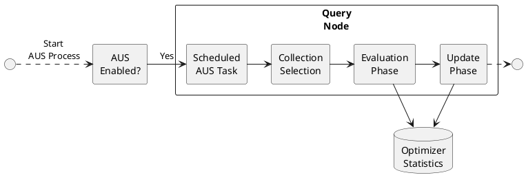

# Auto Update Statistics

Auto Update Statistics (AUS) automatically refreshes optimizer statistics, ensuring accurate and cost-effective query plans.

## Overview

Auto Update Statistics (AUS) is a feature that keeps the optimizer statistics up to date by automatically identifying and refreshing outdated statistics.

Optimizer statistics are crucial as they help the [Cost Based Optimizer](n1ql:n1ql-language-reference/cost-based-optimizer.adoc) generate optimal query plans.
These statistics are initially created when you run the [n1ql:n1ql-language-reference/updatestatistics.adoc](n1ql:n1ql-language-reference/updatestatistics.adoc) statement or build an index (available from 7.6.0 onwards).
However, as data changes over time, the statistics can become stale, leading to sub-optimal query plans and reduced query performance.

To handle this, AUS executes a scheduled task on each query node in the cluster.
This task evaluates statistics based on expiration policies to identify outdated ones and then refreshes them by running the [n1ql:n1ql-language-reference/updatestatistics.adoc](n1ql:n1ql-language-reference/updatestatistics.adoc) statement.
AUS can also optionally generate statistics for indexed expressions that do not already have them.

**📌 NOTE**\
AUS maintains statistics only for expressions on index keys, and only for those indexed using the Plasma storage engine.
It does not support Memory-Optimized indexes.
For more information about these index storage types, see [indexes:storage-modes.adoc](indexes:storage-modes.adoc).

## Availability

AUS is available only in the Couchbase Enterprise Edition and on query nodes running version 8.0 or later.

* You can enable AUS in a cluster that has been fully migrated to 8.0, or in a cluster that includes both 7.6.x and 8.0 query nodes.
In such mixed clusters, the 7.6.x query nodes will not perform any AUS tasks.
* For clusters migrating from pre-7.6.x versions (to a configuration described above), the AUS task can only be enabled once the automatic migration of optimizer statistics to the `_query` collection in the `_system` scope of the buckets has been completed.

## How AUS Works

AUS is an opt-in feature that you must explicitly enable and schedule.
Once it is enabled and a schedule is set, all query nodes in the cluster participate in AUS, according to the same schedule.

### AUS Task Execution

Each node receives its own AUS task, which performs the following actions during its scheduled window:

* The query node first selects specific collections for AUS processing, ensuring that no other query node updates the same collection during this period.
* Each selected collection then goes through two phases: [Evaluation](#evaluation_phase) and [Update](#update_phase).
These phases process statistics gathered from expressions based on fields within that collection.
* After AUS completes processing all statistics in all buckets, the query node schedules the next AUS run.
* If the scheduled window ends before the AUS task finishes, the task is aborted and the next AUS run is scheduled.

<a name="fig-aus-process"></a>**AUS process flow showing the evaluation and update phases**



### Evaluation Phase

In this phase, AUS evaluates whether existing statistics are stale based on the [expiration policy](#expiration-policy).
For each index, AUS assess how much data has changed since the last update of the optimizer statistics for the index’s key expressions.
If the percentage of change exceeds the defined threshold in the [expiration policy](#expiration-policy), the statistics are marked as stale.

Additionally, if configured to do so, this phase also identifies any indexed expressions that currently lack statistics and flags them for creation.
You can control this setting using the `create_missing_statistics` attribute in the [system:aus](#systemaus) catalog.

### Update Phase

After the evaluation, AUS executes [n1ql:n1ql-language-reference/updatestatistics.adoc](n1ql:n1ql-language-reference/updatestatistics.adoc) statements to refresh the statistics identified as stale.
When updating the existing statistics, AUS ensures that the refreshed statistics maintain the original [resolution](n1ql:n1ql-language-reference/cost-based-optimizer.adoc#resolution) at which they were collected.

Also, if the `create_missing_statistics` option is set to `true`, AUS creates new optimizer statistics for indexed expressions that were flagged as missing during the evaluation phase.
The new statistics are created with the default [resolution](n1ql:n1ql-language-reference/cost-based-optimizer.adoc#resolution).

**❗ IMPORTANT**\
When AUS is first enabled, the initial task run might update all existing optimizer statistics, regardless of the expiration policy evaluation.
This is because the index change information might not have been recorded prior to this first run.

### Expiration Policy

AUS uses expiration policies to determine when statistics are outdated and require an update.
The policy is based on the percentage of changes to data within an index.
You can configure this value using the `change_percentage` attribute in the [system:aus](#systemaus) or [system:aus_settings](#systemaus_settings) catalogs.
It defines how much data in an index must change before the statistics are considered outdated.

If the percentage of changed data since the last statistics collection exceeds the defined threshold, AUS flags the statistics as stale.
The subsequent AUS operation then updates these statistics.

## Enable and Schedule AUS

To start using AUS for your cluster, you need to enable it and configure a schedule.
You can configure AUS to run during off-peak hours or at specific times that align with your workload patterns.

AUS maintains its global configurations in the [system:aus](#systemaus) catalog.
You can enable AUS and set its schedule by modifying the relevant configurations within this catalog.

If you need more granular control, use the [system:aus_settings](#systemaus_settings) catalog to customize certain AUS configurations at the bucket, scope, and collection levels.

For a historical record of recent AUS tasks across all query nodes, use the [system:tasks_cache](n1ql:n1ql-intro/sysinfo.adoc#sys-tasks-cache) catalog.
For more information, see [Monitor AUS Tasks](#monitor-aus-tasks).

### system:aus

The `system:aus` catalog contains a single document that holds all the global configurations of AUS.
You can update this document to modify the settings.

<dl><dt><strong>📌 NOTE</strong></dt><dd>

* Only SELECT and UPDATE DMLs are allowed on this keyspace.
* To execute SELECT on `system:aus`, you need the `query_system_catalog` role.
* To execute UPDATE on `system:aus`, you need the `query_manage_system_catalog` role.
</dd></dl>

Each attribute in the document represents a particular global configuration.
The following are the attribute names and the configurations they represent:

| Name | Description | Schema |
| --- | --- | --- |
| ***enable***<br> __required__ | Indicates whether AUS is enabled for the cluster or not. To enable AUS, set this attribute to `true`.<br> If set to `true`, then the `schedule` attribute must also be set. **Default:** `false` | Boolean |
| ***schedule***<br> __optional__ | Defines the schedule for AUS operations. This attribute is required only if `enable` is set to `true`. | [Schedule](#schedule) object |
| ***change_percentage***<br> __required__ | The percentage of change to items within an index that must be exceeded for the statistics to be refreshed. This is the threshold for determining whether the statistics are stale or not. The value must be an integer between `0` and `100`. For example, a value of `30` means that if 30% or more of the items in an index have changed, the statistics for that index are considered stale and will be refreshed. **Default:** `10` | Integer |
| ***all_buckets***<br> __required__ | Indicates whether AUS should be performed on all buckets or only those buckets whose metadata information is loaded on the query node. **Default:** `false` | Boolean |
| ***create_missing_statistics***<br> __required__ | Indicates whether AUS should create statistics that are missing. If set to `true`, AUS creates statistics for indexed expressions that do not have any existing statistics. The statistics will be created using the default value for the [resolution](n1ql:n1ql-language-reference/cost-based-optimizer.adoc#resolution) property. **Default:** `false` | Boolean |

#### Schedule
| Name | Description | Schema |
| --- | --- | --- |
| ***start_time***<br> __required__ | The start time of the AUS schedule in "HH:MM" format. The `start_time` must be at least 30 minutes earlier than the `end_time`. **Example:** `"01:30"` | String |
| ***end_time***<br> __required__ | The end time of the AUS schedule in "HH:MM" format. The `end_time` must be at least 30 minutes later than the `start_time`. **Example:** `"05:30"` | String |
| ***days***<br> __required__ | An array of strings specifying the days on which the AUS schedule runs. Valid values include: `Monday`, `Tuesday`, `Wednesday`, `Thursday`, `Friday`, `Saturday`, `Sunday`. **Example:** `["Saturday", "Sunday"]` | String array |
| ***timezone***<br> __optional__ | The timezone that applies to the schedule’s start and end times. The value must be a valid IANA timezone string. **Default:** `"UTC"` **Example:** `"US/Pacific"` | String |

When changing the global configurations, it is important to consider the following:

* **Enabling AUS**: If AUS was previously disabled and is now enabled, the next AUS task will be scheduled immediately.
* **Rescheduling AUS**: Currently scheduled AUS task will be cancelled, and a new AUS task will be scheduled according to the updated schedule.
Running AUS tasks will not be cancelled.
* **Other Settings**: If other global settings such as `all_buckets` or `change_percentage` are modified, the new values will be applied during the next scheduled AUS run.

#### Example
A sample UPDATE statement to enable AUS and set a schedule with some customizations:

**Query**

```sqlpp
UPDATE system:aus SET enable = true, change_percentage = 20,
schedule = { "start_time": "01:30",
             "end_time": "04:30",
             "timezone": "Asia/Calcutta",
             "days": ["Monday", "Friday"]
        };
```

### system:aus_settings

The `system:aus_settings` catalog stores granular configuration settings for AUS.
These settings can be applied at the bucket, scope, and collection levels.

By default, this catalog has no documents, and the AUS settings for all keyspaces inherit the configurations defined at the global level.
In other words, unless you explicitly configure AUS for a specific keyspace, it will use the global AUS settings defined in [system:aus](#systemaus).

To customize AUS for a specific keyspace, you must insert a settings document into the `system:aus_settings` catalog.
The document ID of a document in this keyspace must be the full path of the bucket, scope, and collection.

Each attribute in the document represents a particular granular configuration.
The following are the attribute names and the configurations they represent:

| Name | Description | Schema |
| --- | --- | --- |

| Boolean

| ***change_percentage***\
__optional__

| The percentage of change to items within an index that must be exceeded for the statistics to be refreshed.

The value must be an integer between `0` and `100`.

If set at a bucket level, this value applies to all scopes and collections within the bucket, unless overridden at a lower level.

If set at a scope level, this value applies to all collections within the scope, unless overridden at a lower level.

**Example:** `30`

| Integer

| ***update_statistics_timeout***\
__optional__

| The timeout period for the [n1ql:n1ql-language-reference/updatestatistics.adoc](n1ql:n1ql-language-reference/updatestatistics.adoc) command.
It is a number representing a duration in seconds.

If the command does not complete within this duration, it times out.
If omitted, a default timeout value is calculated based on the number of samples used.

If set for a keyspace, this timeout applies to every [n1ql:n1ql-language-reference/updatestatistics.adoc](n1ql:n1ql-language-reference/updatestatistics.adoc) statement that AUS executes for that keyspace.

If set at a bucket level, this timeout applies to all scopes and collections within the bucket, unless a different value is set at a lower level.

If set at a scope level, this timeout applies to all collections within the scope, unless a different value is set at a collection level.

| Number

<dl><dt><strong>📌 NOTE</strong></dt><dd>

* All SQL++ DMLs are allowed on this keyspace.
* To execute SELECT on `system:aus_settings`, you need the `query_system_catalog` role.
* To execute UPDATE, DELETE, INSERT, and UPSERT on `system:aus_settings`, you need the `query_manage_system_catalog` role.
</dd></dl>

#### Example
A sample query to add a scope level setting that applies to all collections within the scope.

**Query**

```sqlpp
INSERT INTO system:aus_settings ( KEY, VALUE )
    VALUES ( "default:bucket1.scope1", {"change_percentage": 20} );
```

## Monitor AUS Tasks

The `system:tasks_cache` catalog stores information about all recent tasks executed in a cluster, including the AUS tasks.
For each AUS task, every involved query node maintains an entry within this catalog.
AUS task entries can be specifically identified by the `class` field, which is set to `auto_update_statistics`.

### View Recent AUS Tasks

To view all recent AUS tasks, use the following query:

```sqlpp
SELECT * FROM system:tasks_cache WHERE class = "auto_update_statistics";
```

This query returns all AUS entries regardless of their state (scheduled, running, completed, etc.).
To get the details of completed tasks, see [View Completed AUS Tasks](#view-completed-aus-tasks).

### Find Scheduled AUS Tasks

To identify AUS tasks that are scheduled to run, you can filter the entries using the `state` attribute.

```sqlpp
SELECT * FROM system:tasks_cache WHERE class = "auto_update_statistics" AND state = "scheduled";
```

### View AUS Tasks on a Particular Node

To view recent AUS tasks on a particular node, filter by the `node` attribute.

```sqlpp
SELECT * FROM system:tasks_cache WHERE class = "auto_update_statistics"
         AND state = "scheduled"
         AND node = "127.0.0.1:8091"; // Replace with the actual node address
```

### View Completed AUS Tasks

The entries for completed AUS tasks have information specifically about tasks that have finished execution.
These entries include details such as the task ID, start time, end time, which keyspaces had their statistics updated, and whether any errors occurred during the task execution.

#### Example
A sample task entry for a successful AUS task on a query node:

```json
{
    "tasks_cache": {
        "class": "auto_update_statistics",
        "delay": "21.707164s",
        "id": "4b90bb39-ca1b-55f1-84f0-4d3137c88bf8",
        "name": "bc1ab6e9-9f33-4a8f-86ad-40d74c50af5f",
        "queryContext": "",
        "results": {
            "configuration": {
                "all_buckets": true,
                "change_percentage": 20,
                "end_time": "2024-11-19 20:00:00 +0530 IST",
                "internal_version": 1,
                "start_time": "2024-11-19 19:16:00 +0530 IST"
            },

            "keyspaces_updated": [
                "default:bucket1.scope1.customers"
            ]
        },

        "startTime": "2024-11-19T19:16:00.001+05:30",
        "state": "completed",
        "stopTime": "2024-11-19T19:16:03.154+05:30",
        "subClass": "",
        "submitTime": "2024-11-19T19:15:38.292+05:30"
    }
}
```

For more information about `system:tasks_cache` and its attributes, see [Monitor Cached Tasks](n1ql:n1ql-intro/sysinfo.adoc#sys-tasks-cache).

In addition to the attributes listed there, the AUS task entries also include the following attributes:

* `keyspaces_updated`: A list of keyspaces that had their statistics updated during the AUS task execution.
* `configuration`: The configuration with which the AUS task was executed.

**📌 NOTE**\
You can also retrieve the AUS task history from the `query.log`.

## Cancel AUS Tasks

You can cancel AUS tasks that are currently running or scheduled to run.

* [Cancel Running AUS Tasks](#cancel-running-aus-tasks)
* [Cancel Next Scheduled AUS Tasks](#cancel-next-scheduled-aus-tasks)

**🔥 CAUTION**\
When cancelling AUS tasks, it is important to include appropriate WHERE clauses to specify exactly which tasks you want to cancel.
Make sure your filters target only the intended tasks, otherwise they might inadvertently cancel other tasks or delete task history.

### Cancel Running AUS Tasks

To cancel a running AUS task, delete its entry from the `system:tasks_cache` catalog.
When you delete a task that is in the `scheduled` or `running` state, AUS cancels the task and schedules the next one automatically.

To cancel all running AUS tasks, use the following DELETE statement:

```sqlpp
DELETE FROM system:tasks_cache WHERE class = "auto_update_statistics" AND state = "running";
```

To cancel a running AUS task on a specific node, include the node’s address in the WHERE clause:

```sqlpp
DELETE FROM system:tasks_cache
        WHERE class = "auto_update_statistics"
        AND state = "running"
        AND node = "127.0.0.1:8091"; // Replace with the actual node address
```

### Cancel Next Scheduled AUS Tasks

To cancel an upcoming scheduled AUS task, you need to temporarily modify its schedule in the `system:aus` catalog.
After the scheduled time has passed, you can revert it to its original schedule.

#### Temporarily Update the Schedule

First, identify the specific AUS task you want to skip or cancel.
Then, use an UPDATE statement to exclude the day or time from its schedule.

For example, if your AUS tasks run on Monday, Wednesday, and Friday, and you want to cancel the upcoming Monday run:

```sqlpp
UPDATE system:aus SET schedule.days = ["Wednesday", "Friday"];
```

#### Revert the Schedule

After the day and time for the cancelled task have passed, you can revert the schedule to its original settings.
This allows your AUS tasks to resume their regular schedule for all subsequent runs.

For example, to restore the Monday, Wednesday, and Friday schedule after skipping the Monday run:

```sqlpp
UPDATE system:aus SET schedule.days = ["Monday", "Wednesday", "Friday"];
```

## Manage AUS Load

When an AUS task runs, it can increase the load on the query node as it evaluates and updates statistics.
Therefore, to minimize performance impact, it is important to schedule AUS to best suit the workloads of your cluster.

To prevent excessive load, the AUS task will not start if the query node’s load is too high during the scheduled window.
In such cases, the task is skipped, and the next AUS task is scheduled.

## Related Links

* [Cost Based Optimizer](n1ql:n1ql-language-reference/cost-based-optimizer.adoc)
* [n1ql:n1ql-language-reference/updatestatistics.adoc](n1ql:n1ql-language-reference/updatestatistics.adoc)
* [System Catalogs](n1ql:n1ql-intro/sysinfo.adoc)
