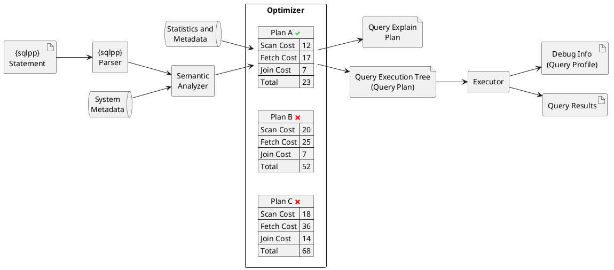

# Understand the Cost-Based Optimizer for Queries

The cost-based optimizer takes into account the cost of memory, CPU, network transport, and disk usage when choosing the optimal plan to execute a query.

## Overview

The _cost-based optimizer_ (CBO) is a feature available in Couchbase Server Enterprise Edition that enables the Query service to create the most efficient plan to execute a query.

The execution of a query involves [many possible operations](learn:services-and-indexes/services/query-service.adoc#query-execution): scan, fetch, join, filter, and so on.
When the query processor is planning the query execution, there may be several possible choices for each operation: for example, there may be different possible indexes, or a choice of join types.
With each of these operations, some of these choices are quicker and more efficient than others.
The query processor attempts to choose the most efficient options when creating the query execution plan.
The legacy [rules-based optimizer](learn:services-and-indexes/services/query-service.adoc#query-service-architecture) (RBO), as its name suggests, takes a rules-based approach; but this does not always lead to the optimum query plan.

The cost-based optimizer uses metadata and statistics to estimate the amount of processing (memory, CPU, network traffic, and I/O) required for each operation.
It compares the cost of alternative routes, and then selects the query-execution plan with the least cost.

**Query execution flow, showing the cost-based optimizer using statistics and metadata**

The cost-based optimizer can generate a query plan for [SELECT](n1ql-language-reference/selectintro.adoc), [UPDATE](n1ql-language-reference/update.adoc), [DELETE](n1ql-language-reference/delete.adoc), [MERGE](n1ql-language-reference/merge.adoc), and [INSERT INTO with SELECT](n1ql-language-reference/insert.adoc) queries.

As an analogy, imagine that you need to travel from one side of a major city to the other by train.
There may be many options available to you: commuter rail, metro, or light rail.
You may also need to change from one service to another at an interchange station, perhaps more than once.
By combining the fastest services with the smallest number of changes and the shortest wait time at each interchange, you can get to your destination in the most efficient way.

Of course, to plan your route, you need to have knowledge of the train frequencies, the size and accessibility of the interchange stations, and how busy the services are likely to be at the time when you travel.
Each of these factors imposes a cost on the options that are available to you.
If you have a greater knowledge and experience of the city’s rail network, you will be better informed about these costs, and better able to plan the optimum journey.

## Advantages of the Cost-Based Optimizer

The cost-based optimizer calculates a cost for a query plan that takes into consideration resource usages during query execution, thus can potentially generate an optimum query plan.

### Index Selection

The cost-based optimizer takes into consideration the characteristics of each qualified index, and thus can better differentiate between similar indexes.
The cost-based optimizer also reduces the need for intersect scans, since it can determine whether one index is better than another based on cost information.

Refer to [INDEX](n1ql-language-reference/keyspace-hints.adoc#index) for an example.

### Join Method

In Couchbase Server Enterprise Edition, two join methods are supported: nested-loop join and hash join.
With the legacy [rules-based optimizer](learn:services-and-indexes/services/query-service.adoc#query-service-architecture), nested-loop join is used by default, and hash join is only considered when a USE HASH hint is specified.
With the cost-based optimizer, both join methods are considered, and the optimizer chooses a join method based on cost information.

Refer to [USE_NL](n1ql-language-reference/keyspace-hints.adoc#use_nl) and [USE_HASH](n1ql-language-reference/keyspace-hints.adoc#use_hash) for examples.

### Join Enumeration

With the legacy [rules-based optimizer](learn:services-and-indexes/services/query-service.adoc#query-service-architecture), joins are performed in the order in which they are specified in the query, and no reordering of joins is considered.
With the cost-based optimizer, different join orders can be considered, and the optimizer chooses the optimal join order based on cost information.

Refer to [ORDERED](n1ql-language-reference/query-hints.adoc#ordered) for an example.

**📌 NOTE**\
The cost-based optimizer can also exclude certain indexes or join methods when evaluating query plans.
This is particularly useful when you know some options are inefficient and not suitable for your query.
For more information, see [n1ql-language-reference/negative-keyspace-hints.adoc](n1ql-language-reference/negative-keyspace-hints.adoc).

## Optimizer Statistics

The cost-based optimizer uses keyspace statistics, index statistics, and distribution statistics.
Before you can use the cost-based optimizer with a query, you must first gather the statistics that it needs.

In Couchbase Server 7.6 and later, the Query service automatically gathers statistics whenever an index is created or built.
You can use the [UPDATE STATISTICS](n1ql-language-reference/updatestatistics.adoc) statement to gather statistics at any time.

To keep optimizer statistics up to date, an opt-in feature called [Auto Update Statistics (AUS)](n1ql:n1ql-language-reference/auto-update-statistics.adoc) is available starting with Couchbase Server 8.0.
When enabled, AUS automatically identifies and refreshes outdated statistics, ensuring that the cost-based optimizer always has the latest information for generating query plans.

If the cost-based optimizer cannot properly calculate cost information for any step of a query plan, e.g. due to lack of the necessary optimizer statistics, the Query service falls back on the [rules-based {sqlpp} optimizer](learn:services-and-indexes/services/query-service.adoc#query-service-architecture) to generate a query plan.

The cost-based optimizer uses the following statistics.

For keyspaces:

* The number of documents in the keyspace.
* The average document size.

For indexes using standard index storage:

* The number of items in the index.
* The number of index pages.
* The resident ratio.
* The average item size.
* The average page size.
* The number of documents indexed.

For indexes using memory-optimized index storage:

* The number of items in the index.
* The average item size.

For data:

* Distribution statistics -- refer to [the section below](#distribution-statistics).

## Distribution Statistics

The cost-based optimizer can collect distribution statistics on predicate expressions.
These predicate expressions may be fields, nested fields, array expressions, or any of the expressions supported as an index key.

The distribution statistics enable the optimizer to estimate the cost for predicates like `c1 = 100`, `c1 >= 20`, or `c1 < 150`.
They also enable cost estimates for join predicates such as `t1.c1 = t2.c2`, assuming distribution statistics exist for both `t1.c1` and `t2.c2`.

### Distribution Bins

The optimizer takes a sample of the values returned by the expression across the keyspace.
These sample values are sorted into _distribution bins_ by data type and value.

1. Values with different data types are placed into separate distribution bins.
(A field may contain values of several different data types across documents.)
2. After being separated by data type, values are sorted further into separate bins depending on their value.

The distribution bins are of approximately equal size, except for the last distribution bin for each data type, which could be a partial bin.

### Overflow Bins

For each distribution bin, the number of distinct values is calculated, as a fraction of the total number of documents.

If a particular value is highly duplicated and represents more than 25% of a distribution bin, it is removed from the distribution bin and placed in an _overflow bin_.
MISSING, NULL, or boolean values are always placed in an overflow bin.

### Boundary Bins

Each distribution bin has a maximum value, which acts as the minimum value for the next bin.

A _boundary bin_ containing no values is created before the first distribution bin of each different data type.
The boundary bin contains no values.
This provides the minimum value for the first bin of each type.

### Histogram

The boundary bins, distribution bins, and overflow bins for each data type are chained together in the [default ascending collation order](n1ql-language-reference/datatypes.adoc#collation) used for {sqlpp} data types:

* MISSING
* NULL
* FALSE
* TRUE
* number
* string
* array
* object
* binary (non-JSON)

This forms a histogram of statistics for the index-key expression across multiple data types.

**Distribution bins and boundary bins for integers, strings, and arrays**

```plantuml
@startuml

skinparam defaultTextAlignment center
skinparam linetype ortho

rectangle "Integer Values" {
  json " " as A {
    "Size": "25%",
    "Distinct": 23,
    "Max": 300
  }
  json " " as B {
    "Size": "25%",
    "Distinct": 49,
    "Max": 2000
  }
  json " " as C {
    "Size": "25%",
    "Distinct": 88,
    "Max": 8000
  }
  json " " as D {
    "Size": "25%",
    "Distinct": 3,
    "Max": 10000
  }
}

rectangle "String Values" {
  card "Boundary" as E
  json " " as F {
    "Size": "25%",
    "Distinct": 92,
    "Max": "A232"
  }
  json " " as G {
    "Size": "25%",
    "Distinct": 23,
    "Max": "F348"
  }
  json " " as H {
    "Size": "25%",
    "Distinct": 20,
    "Max": "L283"
  }
  json " " as I {
    "Size": "25%",
    "Distinct": 3,
    "Max": "Z82"
  }
}

rectangle "Array Values" {
  card "Boundary" as J
  json " " as K {
    "Size": "25%",
    "Distinct": 48,
    "Max": "[234]"
  }
  json " " as L {
    "Size": "25%",
    "Distinct": 28,
    "Max": "[948]"
  }
}

  A . B
  B . C
  C . D
  D . E
  E . F
  F . G
  G . H
  H . I
  I . J
  J . K
  K . L

@enduml
```

### Resolution

The number of distribution bins is determined by the _resolution_.

The default resolution is `1.0`, meaning each distribution bin contains 1% of the documents, and therefore 100 bins are required.
The minimum resolution is `0.02` (5000 distribution bins) and the maximum is `5.0` (20 distribution bins).
The cost-based optimizer calculates the bin size based on the resolution and the number of documents in the collection.

The resolution can be specified when you use the [UPDATE STATISTICS](n1ql-language-reference/updatestatistics.adoc) statement.

### Sample Size

The size of the sample that is collected when gathering statistics is determined by the _sample size_.

The cost-based optimizer calculates a default minimum sample size based on the resolution information.
You can optionally specify the sample size when you use the [UPDATE STATISTICS](n1ql-language-reference/updatestatistics.adoc) statement.

If you do not specify a sample size, or if the specified sample size is smaller than the default minimum sample size, the default minimum sample size is used instead.

## Settings and Parameters

The cost-based optimizer is enabled by default.
You can enable or disable it as required.

* The [request-level](n1ql:n1ql-manage/query-settings.adoc#use_cbo_req) `use_cbo` parameter specifies whether the cost-based optimizer is enabled per request.
If a request does not include this parameter, the node-level setting is used.
* The [node-level](n1ql:n1ql-manage/query-settings.adoc#use-cbo-srv) `use-cbo` setting specifies whether the cost-based optimizer is enabled for a single query node.
It defaults to `true`.
* The {queryUseCBO}[cluster-level] `queryUseCBO` setting enables you to specify the node-level setting for all the nodes in the cluster.

You can also enable or disable the cost-based optimizer using the [Query Settings](manage:manage-settings/general-settings.adoc#query-settings) in the Couchbase Web Console.

If the cost-based optimizer is not enabled, the Query service falls back on the [rules-based {sqlpp} optimizer](learn:services-and-indexes/services/query-service.adoc#query-service-architecture).

### Optimizer Hints

You can supply hints to the optimizer within a specially-formatted hint comment.
For example, you can specify a particular index; specify a join method for a particular join; or request that the query should use the join order as written.
For further details, refer to [Optimizer Hints](n1ql-language-reference/optimizer-hints.adoc).

## Using the Cost-Based Optimizer

When enabled, the optimizer performs the following tasks when a query is executed:

1. Rewrite the query if necessary, in the same manner as the previous rules-based optimizer.
2. Use the distribution histogram and index statistics to estimate the _selectivity_ of a predicate -- that is, the number of documents that the optimizer expects to retrieve which satisfy this predicate.
3. Use the selectivity to estimate the _cardinality_ -- that is, the number of documents remaining after all applicable predicates are applied.
4. Use the cardinality to estimate the cost of different access paths.
5. Compare the costs and generate a query execution plan with the lowest cost.

As described above, the cost-based optimizer can choose the optimal join method for each join, and rewrites the query to use the optimal join ordering.

The optimizer adds cost and cardinality estimates to every step in the query plan.
You can see these estimates using the [EXPLAIN](n1ql-language-reference/explain.adoc) command.
Refer to the documentation for the [UPDATE STATISTICS](n1ql-language-reference/updatestatistics.adoc) statement to see examples of how to generate optimizer statistics, and queries that use these optimizer statistics to calculate cost information in order to generate a query plan.

## Related Links

* [UPDATE STATISTICS](n1ql-language-reference/updatestatistics.adoc) statement
* [n1ql-language-reference/optimizer-hints.adoc](n1ql-language-reference/optimizer-hints.adoc) overview
* [Auto Update Statistics](n1ql:n1ql-language-reference/auto-update-statistics.adoc)
* Blog post: [Cost Based Optimizer for Couchbase N1QL](https://blog.couchbase.com/?p=7384&preview=true)
