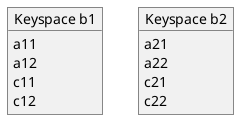

# JOIN Clause

<style type="text/css">
  /* DOC-10177 */
  .hdlist table tr td.hdlist1,
  .hdlist table tr td.hdlist2 {
    padding: 1.5rem 0 0;
  }

  /* Compact horizontal definition lists */
  .hdlist.compact,
  .hdlist.compact {
    padding-top: 1rem;
  }
  .hdlist.compact table tr td.hdlist1,
  .hdlist.compact table tr td.hdlist2 {
    padding: 0.5rem 0 0;
  }

  /* Descriptions in horizontal description lists should have left padding */
  .hdlist table tr td.hdlist2,
  .hdlist.compact table tr td.hdlist2 {
    padding-left: 1rem;
  }

  /* Paragraphs in horizontal description lists should not have left margin */
  .hdlist table .hdlist1 + .hdlist2 p {
    margin-left: 0; !important
  }

  /* Horizontal definitions should match style of vertical definitions */
  td.hdlist1 {
    font-weight: 600;
  }
</style>

The `JOIN` clause enables you to create new input objects by combining two or more source objects.

## Purpose

The `JOIN` clause is used within the [FROM](n1ql-language-reference/from.adoc) clause.
It creates an input object by combining two or more source objects.
Couchbase Server supports three types of `JOIN` clause, which are described in the sections below: [ANSI JOIN](#ansi-join-clause), [Lookup JOIN](#lookup-join-clause), and [Index JOIN](#index-join-clause).

Couchbase Server also supports comma-separated joins.
For further details, refer to [n1ql-language-reference/comma.adoc](n1ql-language-reference/comma.adoc).

## Prerequisites

For you to select data from keyspace or expression, you must have the `query_select` privilege on that keyspace.
For more details about user roles, see
[Authorization](learn:security/authorization-overview.adoc).

## Syntax

```ebnf
join-clause ::= ansi-join-clause | lookup-join-clause | index-join-clause
```


* **ansi-join-clause**\
[ANSI JOIN Clause](#ansi-join-clause) icon:caret-down[]
* **lookup-join-clause**\
[Lookup JOIN Clause](#lookup-join-clause) icon:caret-down[]
* **index-join-clause**\
[Index JOIN Clause](#index-join-clause) icon:caret-down[]

### Left-Hand Side

The pass:q[`JOIN` clause] cannot be the first term within the `FROM` clause; it must be preceded by another FROM term.
The term immediately preceding the pass:q[`JOIN` clause] represents the _left-hand side_ of the pass:q[`JOIN` clause].

You can chain the pass:q[`JOIN` clause] with any of the other permitted FROM terms, including another pass:q[`JOIN` clause].
For more information, see the page on the [FROM](n1ql-language-reference/from.adoc) clause.

There are restrictions on what types of FROM terms may be chained and in what order -- see the descriptions on this page for more details.

The types of FROM term that may be used as the left-hand side of the pass:q[`JOIN` clause] are summarized in the following table.

To try the examples in this section, set the query context to the `inventory` scope in the travel sample dataset.
For more information, see [Query Context](n1ql:n1ql-intro/queriesandresults.adoc#query-context).

| Type | Example |
| --- | --- |
| [keyspace identifier](n1ql-language-reference/from.adoc#sec_from-keyspace) |  |
```N1QL
hotel
```
| [generic expression](n1ql-language-reference/from.adoc#generic-expr) |  |
```N1QL
20+10 AS Total
```
| [subquery](n1ql-language-reference/from.adoc#select-expr) |  |
```N1QL
SELECT ARRAY_AGG(t1.city) AS cities,
  SUM(t1.city_cnt) AS apnum
FROM (
  SELECT city, city_cnt, country,
    ARRAY_AGG(airportname) AS apnames
  FROM airport
  GROUP BY city, country
  LETTING city_cnt = COUNT(city)
) AS t1
WHERE t1.city_cnt > 5;
```
| previous [join](n1ql-language-reference/join.adoc), [nest](n1ql-language-reference/nest.adoc), or [unnest](n1ql-language-reference/unnest.adoc) |  |
```N1QL
SELECT *
FROM route AS rte
JOIN airport AS apt
  ON rte.destinationairport = apt.faa
NEST landmark AS lmk
  ON apt.city = lmk.city
LIMIT 5;
```

## ANSI JOIN Clause

### Purpose

To be closer to standard SQL syntax, ANSI JOIN can join arbitrary fields of the documents and can be chained together.

**📌 NOTE**\
[ANSI JOIN](n1ql-language-reference/join.adoc#section_ek1_jnx_1db) and [ANSI NEST](n1ql-language-reference/nest.adoc#section_tc1_nnx_1db) clauses have much more flexible functionality than their earlier INDEX and LOOKUP equivalents.
Since these are standard compliant and more flexible, we recommend you to use ANSI JOIN and ANSI NEST exclusively, where possible.

### Syntax

```ebnf
ansi-join-clause ::= ansi-join-type? 'JOIN' 'LATERAL'? ansi-join-rhs ansi-join-predicate
```


* **ansi-join-type**\
[Join Type](#join-type) icon:caret-down[]
* **ansi-join-rhs**\
[ANSI JOIN Right-Hand Side](#ansi-join-right-hand-side) icon:caret-down[]
* **ansi-join-predicate**\
[Join Predicate](#join-predicate) icon:caret-down[]

#### Join Type

```ebnf
ansi-join-type ::= 'INNER' | ( 'LEFT' | 'RIGHT' ) 'OUTER'?
```


This clause represents the type of ANSI join.

* **`INNER`**\
For each joined object produced, both the left-hand side and right-hand side source objects of the `ON` clause must be non-MISSING and non-NULL.
* **`LEFT [OUTER]`**\
{startsb}Query Service interprets `LEFT` as `LEFT OUTER`{endsb}

  For each joined object produced, only the left-hand source objects of the `ON` clause must be non-MISSING and non-NULL.
* **`RIGHT [OUTER]`**\
{startsb}Query Service interprets `RIGHT` as `RIGHT OUTER`{endsb}

  For each joined object produced, only the right-hand source objects of the `ON` clause must be non-MISSING and non-NULL.

This clause is optional.
If omitted, the default is `INNER`.

The following table summarizes the ANSI join types currently supported, and describes how you may chain them together.
{sqlpp} does not support full outer joins.

To try the examples in this section, set the query context to the `inventory` scope in the travel sample dataset.
For more information, see [Query Context](n1ql:n1ql-intro/queriesandresults.adoc#query-context).

| Join Type | Remarks | Example |
| --- | --- | --- |
| **[INNER] JOIN \... ON** .2+.^ | INNER JOIN and LEFT OUTER JOIN can be mixed in any number and/or order. |  |
```sqlpp
SELECT *
FROM route
JOIN airline
ON route.airlineid = META(airline).id
WHERE airline.country = "France";
```
```sqlpp
SELECT *
FROM route
LEFT JOIN airline
ON route.airlineid = META(airline).id
WHERE route.sourceairport = "SFO";
```
| **LEFT [OUTER] JOIN \... ON** |  | **RIGHT [OUTER] JOIN \... ON** |
```sqlpp
SELECT *
FROM route
RIGHT JOIN airline
ON route.airlineid = META(airline).id
WHERE route.sourceairport = "SFO";
```

In Couchbase Server 6.5 and later, if you create either of the following:

* A LEFT OUTER JOIN where all the NULL or MISSING results on the right-hand side are filtered out by the [WHERE clause](n1ql-language-reference/where.adoc) or by the ON clause of a subsequent INNER JOIN, or
* A RIGHT OUTER JOIN where all the NULL or MISSING results on the left-hand side are filtered out by the [WHERE clause](n1ql-language-reference/where.adoc) or by the ON clause of a subsequent INNER JOIN,

Then the query is transformed internally into an INNER JOIN for greater efficiency.

#### LATERAL Join

When an expression on the right-hand side of an ANSI join references a keyspace that is already specified in the same FROM clause, the expression is said to be correlated.
In relational databases, a join which contains correlated expressions is referred to as a lateral join.
In {sqlpp}, lateral correlations are detected automatically, and there is no need to specify that a join is lateral.

In Couchbase Server 7.6 and later, you can use the LATERAL keyword as a visual reminder that a join contains correlated expressions.
The LATERAL keyword is not required -- the keyword is included solely for compatibility with queries from relational databases.

If you use the LATERAL keyword in a join that has no lateral correlation, the keyword is ignored.

INNER JOINS and LEFT OUTER JOINS support the optional LATERAL keyword in front of the right-hand side keyspace.

RIGHT OUTER JOINS do not support the optional LATERAL keyword.

**📌 NOTE**\
Using the LATERAL keyword in an ANSI join implies that the right-hand side of the join must appear after the left-hand side of the join. This may prevent the cost-based optimizer from reordering joins in the query to give the optimal join order. For details, see [Join Enumeration](n1ql:n1ql-language-reference/cost-based-optimizer.adoc#join-enumeration).

#### Join Predicate

```ebnf
ansi-join-predicate ::= 'ON' expr
```


* **`expr`**\
Boolean expression representing the join condition between the left-hand side [FROM term](#left-hand-side) and the [ANSI JOIN Right-Hand Side](#ansi-join-right-hand-side).
This expression may contain fields, constant expressions, or any complex {sqlpp} expression.

### Limitations

* A RIGHT OUTER join is only supported when it’s the only join in the query; or when it’s the first join in a chain of joins.
* No mixing of ANSI join syntax with lookup or index join syntax in the same FROM clause.
* If the right-hand side of an ANSI join is a keyspace reference, then for the nested-loop join method an appropriate secondary index must exist on the right-hand side keyspace; for the hash join method, a primary index can be used.
* Adaptive indexes are not considered when selecting indexes on inner side of the join.
* You may chain ANSI joins with comma-separated joins; however, the comma-separated joins must come after any JOIN, NEST, or UNNEST clauses.

### Examples

To try the examples in this section, set the query context to the `inventory` scope in the travel sample dataset.
For more information, see [Query Context](n1ql:n1ql-intro/queriesandresults.adoc#query-context).

<a name="ANSI-Join-Example-1"></a>**Inner Join**

List the source airports and airlines that fly into SFO, where only the non-null `route` documents join with matching `airline` documents.

```sqlpp
SELECT route.airlineid, airline.name, route.sourceairport, route.destinationairport
FROM route
INNER JOIN airline
ON route.airlineid = META(airline).id
WHERE route.destinationairport = "SFO"
ORDER BY route.sourceairport;
```

**Results**

```JSON
[
  {
    "airlineid": "airline_5209",
    "destinationairport": "SFO",
    "name": "United Airlines",
    "sourceairport": "ABQ"
  },
  {
    "airlineid": "airline_5209",
    "destinationairport": "SFO",
    "name": "United Airlines",
    "sourceairport": "ACV"
  },
  {
    "airlineid": "airline_5209",
    "destinationairport": "SFO",
    "name": "United Airlines",
    "sourceairport": "AKL"
  },
// ...
```

The INNER JOIN only returns results where a left-side document matches a right-side document.

<a name="ANSI-Join-Example-1A"></a>**Inner LATERAL Join**

This example is the same as [Example 1](#ANSI-Join-Example-1), but it includes the optional LATERAL keyword.

```sqlpp
SELECT route.airlineid, airline.name, route.sourceairport, route.destinationairport
FROM route JOIN LATERAL (
  SELECT airline1.name
  FROM airline airline1
  WHERE route.airlineid = META(airline1).id
) AS airline
ON true
WHERE route.destinationairport = "SFO"
ORDER BY route.sourceairport;
```

**Results**

```JSON
[
  {
    "airlineid": "airline_5209",
    "name": "United Airlines",
    "sourceairport": "ABQ",
    "destinationairport": "SFO"
  },
  {
    "airlineid": "airline_5209",
    "name": "United Airlines",
    "sourceairport": "ACV",
    "destinationairport": "SFO"
  },
  {
    "airlineid": "airline_5209",
    "name": "United Airlines",
    "sourceairport": "AKL",
    "destinationairport": "SFO"
  },
  // ...
```

The INNER LATERAL JOIN returns the same results as [Example 1](#ANSI-Join-Example-1).

<a name="ANSI-Join-Example-2"></a>**Left Outer Join of U.S. airports in the same city as a landmark**

List the airports and landmarks in the same city, ordered by the airports.

```sqlpp
SELECT DISTINCT  MIN(aport.airportname) AS Airport__Name,
                 MIN(aport.tz) AS Airport__Time,
                 MIN(lmark.name) AS Landmark_Name
FROM airport aport -- ①
LEFT JOIN landmark lmark -- ②
  ON aport.city = lmark.city
  AND lmark.country = "United States"
GROUP BY aport.airportname
ORDER BY aport.airportname
LIMIT 4;
```

1. The `airport` keyspace is on the left-hand side of the join.
2. The `landmark` keyspace is on the right-hand side of the join.

**Results**

```JSON
[
  {
    "Airport__Name": "Abbeville",
    "Airport__Time": "Europe/Paris",
    "Landmark_Name": null // ①
  },
  {
    "Airport__Name": "Aberdeen Regional Airport",
    "Airport__Time": "America/Chicago",
    "Landmark_Name": null
  },
  {
    "Airport__Name": "Abilene Rgnl",
    "Airport__Time": "America/Chicago",
    "Landmark_Name": null
  },
  {
    "Airport__Name": "Abraham Lincoln Capital",
    "Airport__Time": "America/Chicago",
    "Landmark_Name": null
  }
]
```

1. The LEFT OUTER JOIN lists all the left-side results, even if there are no matching right-side documents, as indicated by the results in which the fields from the `landmark` keyspace are null or missing.

<a name="ANSI-Join-Example-3"></a>**RIGHT OUTER JOIN of [Left Outer Join of U.S. airports in the same city as a landmark](#ANSI-Join-Example-2)**

List the airports and landmarks in the same city, ordered by the landmarks.

```sqlpp
SELECT DISTINCT MIN(aport.airportname) AS Airport__Name,
                MIN(aport.tz) AS Airport__Time,
                MIN(lmark.name) AS Landmark_Name,
FROM airport aport -- ①
RIGHT JOIN landmark lmark -- ②
  ON aport.city = lmark.city
  AND aport.country = "United States"
GROUP BY lmark.name
ORDER BY lmark.name
LIMIT 4;
```

1. The `airport` keyspace is on the left-hand side of the join.
2. The `landmark` keyspace is on the right-hand side of the join.

**Results**

```JSON
[
  {
    "Airport__Name": "San Francisco Intl",
    "Airport__Time": "America/Los_Angeles",
    "Landmark_Name": ""Hippie Temptation" house"
  },
  {
    "Airport__Name": null, // ①
    "Airport__Time": null,
    "Landmark_Name": "'The Argyll Arms Hotel"
  },
  {
    "Airport__Name": null,
    "Airport__Time": null,
    "Landmark_Name": "'Visit the Hut of the Shadows and other End of the Road sculptures"
  },
  {
    "Airport__Name": "London-Corbin Airport-MaGee Field",
    "Airport__Time": "America/New_York",
    "Landmark_Name": "02 Shepherd's Bush Empire"
  }
]
```

1. The RIGHT OUTER JOIN lists all the right-side results, even if there are no matching left-side documents, as indicated by the results in which the fields from the `airport` keyspace are null or missing.

<a name="ANSI-Join-Example-4"></a>**Inner Join with Covering Index**

Use an ANSI JOIN to list the routes and destination airports that are available from London Heathrow (ICAO code `EGLL`).

By default, the ANSI JOIN uses the `def_inventory_route_sourceairport` index, which is installed with the `travel-sample` bucket.
This index has `sourceairport` as its leading key.

**Index**

```sqlpp
CREATE INDEX def_inventory_route_sourceairport
ON route (sourceairport);
```

**Query**

```sqlpp
SELECT META(route).id route_id, route.airline, route.destinationairport
FROM airport JOIN route ON route.sourceairport = airport.faa
WHERE airport.icao = "EGLL"
ORDER BY route_id;
```

**Results**

```JSON
[
  {
    "airline": "AH",
    "destinationairport": "ALG",
    "route_id": "route_10186"
  },
  {
    "airline": "AI",
    "destinationairport": "BOM",
    "route_id": "route_10570"
  },
// ...
```

If no covering index is available, the Query Service has to fetch each matching record from the `route` keyspace to get the airline and destination airport information, as shown in the query plan:


If you create a covering index, with `sourceairport` as the leading key, and `airline` and `destinationairport` as additional index keys:

**Covering Index**

```sqlpp
CREATE INDEX idx_route_src_dst_airline
ON route (sourceairport, destinationairport, airline);
```

\... then the Query Service does not need to fetch any records from the `route` keyspace, as shown in the query plan:


## ANSI JOIN Right-Hand Side

```ebnf
ansi-join-rhs ::= rhs-keyspace | rhs-subquery | rhs-generic
```


In Couchbase Server 6.5 and later, the right-hand side of an ANSI join may be a keyspace reference, a subquery, or a generic expression term.

* **rhs-keyspace**\
[Right-Hand Side Keyspace](#right-hand-side-keyspace) icon:caret-down[]
* **rhs-subquery**\
[Right-Hand Side Subquery](#right-hand-side-subquery) icon:caret-down[]
* **rhs-generic**\
[Right-Hand Side Generic Expression](#right-hand-side-generic-expression) icon:caret-down[]

### Right-Hand Side Keyspace

```ebnf
rhs-keyspace ::= keyspace-ref ( 'AS'? alias )? ansi-join-hints?
```


* **keyspace-ref**\
[Keyspace Reference](#keyspace-reference) icon:caret-down[]
* **alias**\
[AS Alias](#as-alias) icon:caret-down[]
* **ansi-join-hints**\
[ANSI JOIN Hints](#ansi-join-hints) icon:caret-down[]

#### Keyspace Reference

Keyspace reference for the right-hand side of the ANSI join.
For details, see [Keyspace Reference](n1ql-language-reference/from.adoc#from-keyspace-ref).

#### AS Alias

Assigns another name to the keyspace reference.
For details, see [AS Clause](n1ql-language-reference/from.adoc#section_ax5_2nx_1db).

Assigning an alias to the keyspace reference is optional.
If you assign an alias to the keyspace reference, the `AS` keyword may be omitted.

### Right-Hand Side Subquery

```ebnf
rhs-subquery ::= subquery-expr 'AS'? alias
```


* **subquery-expr**\
[Subquery Expression](#subquery-expression) icon:caret-down[]
* **alias**\
[AS Alias](#as-alias) icon:caret-down[]

#### Subquery Expression

Use parentheses to specify a subquery for the right-hand side of the ANSI join.
For details, see [Subquery Expression](n1ql-language-reference/from.adoc#select-expr-clause).

**📌 NOTE**\
A subquery on the right-hand side of the ANSI join cannot be **correlated**, i.e. it cannot refer to a keyspace in the outer query block.
This will lead to an error.

#### AS Alias

Assigns another name to the subquery.
For details, see [AS Clause](n1ql-language-reference/from.adoc#section_ax5_2nx_1db).

You must assign an alias to a subquery on the right-hand side of the join.
However, when you assign an alias to the subquery, the `AS` keyword may be omitted.

### Right-Hand Side Generic Expression

```ebnf
rhs-generic ::= expr ( 'AS'? alias )?
```


* **expr**\
[Expression Term](#expression-term) icon:caret-down[]
* **alias**\
[AS Alias](#as-alias) icon:caret-down[]

#### Expression Term

A {sqlpp} [expression](n1ql-language-reference/index.adoc) generating JSON documents or objects for the right-hand side of the ANSI join.

**📌 NOTE**\
An expression on the right-hand side of the ANSI join may be **correlated**, i.e. it may refer to a keyspace on the left-hand side of the join.
In this case, only a [nested-loop join](#ansi-join-hints) may be used.

#### AS Alias

Assigns another name to the generic expression.
For details, see [AS Clause](n1ql-language-reference/from.adoc#section_ax5_2nx_1db).

You must assign an alias to the generic expression if it is not an identifier; otherwise, assigning an alias is optional.
However, when you assign an alias to the generic expression, the `AS` keyword may be omitted.

### Examples

To try the examples in this section, set the query context to the `inventory` scope in the travel sample dataset.
For more information, see [Query Context](n1ql:n1ql-intro/queriesandresults.adoc#query-context).

<a name="ANSI-Join-Example-sub"></a>**Inner Join with Subquery on Right-Hand Side**

Find the destination airport of all routes whose source airport is in San Francisco.

```sqlpp
SELECT DISTINCT subquery.destinationairport
FROM airport
JOIN (
  SELECT destinationairport, sourceairport
  FROM route
) AS subquery
ON airport.faa = subquery.sourceairport
WHERE airport.city = "San Francisco";
```

**Results**

```JSON
[
  {
    "destinationairport": "HKG"
  },
  {
    "destinationairport": "ICN"
  },
  {
    "destinationairport": "ATL"
  },
  {
    "destinationairport": "BJX"
  },
  {
    "destinationairport": "GDL"
  },
// ...
```

<a name="ANSI-Join-Example-expr"></a>**Inner Join with Generic Expression on Right-Hand Side**

Find the destination airport of all routes in the given array whose source airport is in San Francisco.

```sqlpp
SELECT DISTINCT expression.destinationairport
FROM airport JOIN [
  {"destinationairport": "KEF", "sourceairport": "SFO", "type": "route"},
  {"destinationairport": "KEF", "sourceairport": "LHR", "type": "route"}
] AS expression
ON airport.faa = expression.sourceairport
WHERE airport.city = "San Francisco";
```

**Results**

```JSON
[
  {
    "destinationairport": "KEF"
  }
]
```

## ANSI JOIN Hints

```ebnf
ansi-join-hints ::= use-hash-hint | use-nl-hint | multiple-hints
```


* **use-hash-hint**\
[USE HASH Hint](#use-hash-hint) icon:caret-down[]
* **use-nl-hint**\
[USE NL Hint](#use-nl-hint) icon:caret-down[]
* **multiple-hints**\
[Multiple Hints](#multiple-hints) icon:caret-down[]

Couchbase Server Enterprise Edition supports two join methods for performing ANSI join: nested-loop join and hash join.
Two corresponding join hints are introduced: `USE HASH` and `USE NL`.

The ANSI join hints are similar to the [USE INDEX](n1ql-language-reference/hints.adoc#use-index-clause) or [USE KEYS](n1ql-language-reference/hints.adoc#use-keys-clause) hints.
The ANSI join hints can be specified after the right-hand side of an ANSI join specification.

**📌 NOTE**\
The join hint for the first join should be specified on the first join’s right-hand side, and the join hint for the second join should be specified on the second join’s right-hand side, etc.
If a join hint is specified on the first FROM term, i.e. the first join’s left-hand side, an error is returned.

**💡 TIP**\
You can also supply a join hint within a specially-formatted [hint comment](n1ql-language-reference/optimizer-hints.adoc).
Note that you cannot specify a join hint for the same keyspace using both the `USE` clause and a hint comment.
If you do this, the `USE` clause and the hint comment are both marked as erroneous and ignored by the optimizer.

<a name="default-join-method"></a>**Default Join Method**

{enterprise}

In Enterprise Edition, for an ANSI join with a subquery or a generic expression as the right-hand side, the default method is hash.
In this case:

* The subquery or expression on the right-hand side of the join is used as the [build side](#use-hash-hint) of the hash join.
If `USE HASH(PROBE)` is specified, then the expression or subquery will be used as the [probe side](#use-hash-hint) of the hash join.
* If an expression on the right-hand side is [correlated](#expression-term), a nested-loop join is used.
(If a subquery on the right-hand side is [correlated](#subquery-expression), the query returns an error.)
* If a hash join is not feasible or not supported, or if the `USE NL` hint is specified, a nested-loop join is used.

For other types of join, the default method is nested-loop.
In this case:

* Hash join is only considered when the `USE HASH` hint is specified, and it requires at least one equality predicate between the left-hand side and right-hand side.
* If the join meets these conditions, hash join is used.
If the hash join cannot be generated, then the planner will further consider nested-loop join, and will either generate a nested-loop join or return an error for the join.
* If no join hint is specified, or the `USE NL` hint is specified, then nested-loop join is considered.

---

{community}

For Community Edition (CE), only nested-loop join is considered by the planner, and any specified `USE HASH` hint will be silently ignored.

### USE HASH Hint

```ebnf
use-hash-hint ::= 'USE' use-hash-term
```


```ebnf
use-hash-term ::= 'HASH' '(' ( 'BUILD' | 'PROBE' ) ')'
```


There are two versions of the `USE HASH` hint:

* `USE HASH(BUILD)` -- The right-hand side of the join is to be used as the build side.
* `USE HASH(PROBE)` -- The right-hand side of the join is to be used as the probe side.

A hash join has two sides: a **build** side and a **probe** side.
The build side of the join will be used to create an in-memory hash table.
The probe side will use that table to find matches and perform the join.
Typically, this means you want the build side to be used on the smaller of the two sets.
However, you can only supply one hash hint, and only to the right side of the join.
So if you specify `BUILD` on the right side, then you are implicitly using `PROBE` on the left side (and vice versa).

This clause is equivalent to the `USE_HASH` optimizer hint.
For more details, refer to [Keyspace Hints](n1ql-language-reference/keyspace-hints.adoc#use-hash).

### USE NL Hint

```ebnf
use-nl-hint ::= 'USE' use-nl-term
```


```ebnf
use-nl-term ::= 'NL'
```


This join hint instructs the planner to use nested-loop join (NL join) for the join being considered.

This clause is equivalent to the `USE_NL` optimizer hint.
For more details, refer to [Keyspace Hints](n1ql-language-reference/keyspace-hints.adoc#use-hash).

### Multiple Hints

```ebnf
multiple-hints ::= 'USE' ( ansi-hint-terms other-hint-terms |
                           other-hint-terms ansi-hint-terms )
```


```ebnf
ansi-hint-terms ::= use-hash-term | use-nl-term
```


```ebnf
other-hint-terms ::= use-index-term | use-keys-term
```


You can use only one join hint ([USE HASH](#use-hash-term) or [USE NL](#use-nl-term)) together with only one other hint ([USE INDEX](n1ql-language-reference/hints.adoc#use-index-term) or [USE KEYS](n1ql-language-reference/hints.adoc#use-keys-term)) for a total of two hints.
The order of the two hints doesn’t matter.

When multiple hints are being specified, use only one `USE` keyword with one following the other, as shown in [USE INDEX with USE HASH](#Multiple-hint-Example-1) and [USE HASH with USE KEYS](#Multiple-hint-Example-2).

When chosen, the hash join will always work; the restrictions are on any USE KEYS hint clause:

* Must not depend on any previous keyspaces.
* The expression must be constants, host variables, etc.
* Must not contain any subqueries.

**📌 NOTE**\
If the USE KEYS hint contains references to other keyspaces or subqueries, then the USE HASH hint will be ignored and nested-loop join will be used instead.

### Examples

To try the examples in this section, set the query context to the `inventory` scope in the travel sample dataset.
For more information, see [Query Context](n1ql:n1ql-intro/queriesandresults.adoc#query-context).

<a name="USE-HASH-Example-1"></a>**USE HASH with PROBE**

The keyspace `aline` is to be joined (with `rte`) using hash join, and `aline` is used as the probe side of the hash join.

```sqlpp
SELECT COUNT(1) AS Total_Count
FROM route rte
INNER JOIN airline aline
USE HASH (PROBE)
ON rte.airlineid = META(aline).id;
```

**Results**

```JSON
[
  {
    "Total_Count": 17629
  }
]
```

<a name="USE-HASH-Example-2"></a>**USE HASH with BUILD**

This is effectively the same query as the previous example, except the two keyspaces are switched, and here the `USE HASH(BUILD)` hint is used, indicating the hash join should use `rte` as the build side.

```sqlpp
SELECT COUNT(1) AS Total_Count
FROM airline aline
INNER JOIN route rte
USE HASH (BUILD)
ON (rte.airlineid = META(aline).id);
```

**Results**

```JSON
[
  {
    "Total_Count": 17629
  }
]
```

**USE NL**

```sqlpp
SELECT a.airportname AS airport, r.id AS route
FROM route AS r
JOIN airport AS a
USE NL
ON a.faa = r.sourceairport
WHERE r.sourceairport = "SFO"
LIMIT 4;
```

<a name="Multiple-hint-Example-1"></a>**USE INDEX with USE HASH**

```sqlpp
SELECT COUNT(1) AS Total_Count
FROM route rte
INNER JOIN airline aline
USE INDEX (idx_destinations) HASH (PROBE)
ON (rte.airlineid = META(aline).id);
```

<a name="Multiple-hint-Example-2"></a>**USE HASH with USE KEYS**

```sqlpp
SELECT COUNT(1) AS Total_Count
FROM route rte
INNER JOIN airline aline
USE HASH (PROBE) KEYS ["airline_10", "airline_21", "airline_22"]
ON (rte.airlineid = META(aline).id);
```

## ANSI JOIN and Arrays

ANSI JOIN provides great flexibility since the `ON` clause of an ANSI JOIN can be any expression as long as it evaluates to TRUE or FALSE.
Below are different join scenarios involving arrays and ways to handle each scenario.

<dl><dt><strong>📌 NOTE</strong></dt><dd>

These keyspaces and indexes will be used throughout this section’s array scenarios.
As a convention, when a field name starts with `a` it is an array, so each keyspace has two array fields and two regular fields.



Within each keyspace, both `_idx1` indexes index each element of its array, while both `_idx2` indexes use its entire array as the index key.

```sqlpp
CREATE INDEX b1_idx1 ON b1 (c11, c12, DISTINCT a11);
CREATE INDEX b1_idx2 ON b1 (a12);
CREATE INDEX b2_idx1 ON b2 (c21, c22, DISTINCT a21);
CREATE INDEX b2_idx2 ON b2 (a22);
```
</dd></dl>

### ANSI JOIN with No Arrays

In this scenario, there is no involvement of arrays in the join.
These are just straight-forward joins:

```sqlpp
SELECT *
FROM b1
JOIN b2
  ON b1.c11 = b2.c21
  AND b2.c22 = 100
WHERE b1.c12 = 10;
```

Here the joins are using non-array fields of each keyspace.

The following case also falls in this scenario:

```sqlpp
SELECT *
FROM b1
JOIN b2
  ON b1.c11 = b2.c21
  AND b2.c22 = 100
  AND ANY v IN b2.a21 SATISFIES v = 10 END
WHERE b1.c12 = 10;
```

In this example, although there is an ANY predicate on the right-hand side array `b2.a21`, the ANY predicate does not involve any joins, and thus, as far as the join is concerned, it is still a 1-to-1 join.
Similarly:

```sqlpp
SELECT *
FROM b1
JOIN b2
  ON b1.c11 = b2.c21
WHERE b1.c11 = 10
  AND b1.c12 = 100
  AND ANY v IN b1.a11 SATISFIES v = 20 END;
```

In this case the ANY predicate is on the left-hand side array `b1.a11`; however, similar to above, the ANY predicate does not involve any joins, and thus the join is still 1-to-1.
We can even have ANY predicates on both sides:

```sqlpp
SELECT *
FROM b1
JOIN b2
  ON b1.c11 = b2.c21
  AND b2.c22 = 100
  AND ANY v IN b2.a21 SATISFIES v = 10 END
WHERE b1.c11 = 10
  AND b1.c12 = 100
  AND ANY v IN b1.a11 SATISFIES v = 10 END;
```

Again, the ANY predicates do not involve any join, and the join is still 1-to-1.

### ANSI JOIN with Entire Array as Index Key

As a special case, it is possible to perform ANSI JOIN on an entire array as a join key:

```sqlpp
SELECT *
FROM b1
JOIN b2
  ON b1.a21 = b2.a22
WHERE b1.c11 = 10
  AND b1.c12 = 100;
```

In this case, the entire array must match each other for the join to work.
For all practical purposes, the array here is treated as a scalar since there is no logic to iterate through elements of an array here.
The entire array is used as an index key (`b2_idx2`) and as such, an entire array is used as an index span to probe the index.
The join here can also be considered as 1-to-1.

### ANSI JOIN Involving Right-Hand Side Arrays

In this scenario, the join involves an array on the right-hand side keyspace:

```sqlpp
SELECT *
FROM b1
JOIN b2
  ON b2.c21 = 10
  AND b2.c22 = 100
  AND ANY v IN b2.a21 SATISFIES v = b1.c12 END
WHERE b1.c11 = 10;
```

In this case, the ANY predicate involves a join, and thus, effectively we are joining `b1` with elements of the `b2.a21` array.
This now becomes a 1-to-many join.
Note that we use an ANY clause for this scenario since it’s a natural extension of the existing support for array indexes; the only difference is for index span generation, we now can have a potential join expression.
Array indexes can be used for join in this scenario.

### ANSI JOIN Involving Left-Hand Side Arrays

This is a slightly more complex scenario, where the array reference is on the left-hand side of the join, and it’s a many-to-1 join.
There are two alternative ways to handle the scenario where the array appears on the left-hand side of the join.

#### Use UNNEST

This alternative will flatten the left-hand side array first, before performing the join:

```sqlpp
SELECT *
FROM b1 UNNEST b1.a12 AS ba1
JOIN b2
  ON ba1 = b2.c22
  AND b2.c21 = 10
WHERE b1.c11 = 10
  AND b1.c12 = 100;
```

The [UNNEST](#unnest) operation is used to flatten the array, turning one left-hand side document into multiple documents; and then for each one of them, join with the right-hand side.
This way, by the time join is being performed, it is a regular join, since the array is already flattened in the UNNEST step.

#### Use IN clause

This alternative uses the IN clause to handle the array:

```sqlpp
SELECT *
FROM b1
JOIN b2
  ON b2.c22 IN b1.a12 AND b2.c21 = 10
WHERE b1.c11 = 10 AND b1.c12 = 100;
```

By using the [IN](n1ql-language-reference/indexing-arrays.adoc) clause, the right-hand side field value can match any of the elements of the left-hand side array.
Conceptually, we are using each element of the left-hand side array to probe the right-hand side index.

#### Differences Between the Two Alternatives

There is a semantical difference between the two alternatives.
With UNNEST, we are first turning one left-hand side document into multiple documents and then performing the join.
With IN-clause, there is still only one left-hand side document, which can then join with one or more right-hand side documents.
Thus:

* If the array contains duplicate values,
  * the UNNEST method treats each duplicate as an individual value and thus duplicated results will be returned;
  * the IN clause method will not duplicate the result.
* If no duplicate values exists and we are performing inner join,
  * then the two alternatives will likely give the same result.
* If outer join is performed, assuming there are N elements in the left-hand side array, and assuming there is at most one matching document from the right-hand side for each element of the array,
  * the UNNEST method will produce N result documents;
  * the IN clause method may produce < N result documents if some of the array elements do not have matching right-hand side documents.

### ANSI JOIN with Arrays on Both Sides

If the join involves arrays on both sides, then we can combine the approaches above, i.e., using ANY clause to handle the right-hand side array and either UNNEST or IN clause to handle the left-hand side array.
For example:

```sqlpp
SELECT *
FROM b1
UNNEST b1.a12 AS ba1
  JOIN b2
    ON ANY v IN b2.a21 SATISFIES v = ba1 END
    AND b2.c21 = 10
    AND b2.c22 = 100
WHERE b1.c11 = 10
  AND b1.c12 = 100;
```

or

```sqlpp
SELECT *
FROM b1
JOIN b2
  ON ANY v IN b2.a21 SATISFIES v IN b1.a12 END
  AND b2.c21 = 10
  AND b2.c22 = 100
WHERE b1.c11 = 10
  AND b1.c12 = 100;
```

## Lookup JOIN Clause

### Purpose

A _lookup join_ is a legacy syntax for joins.
It enables you to join a foreign key field on the left-hand side of the join with the primary [document key](learn:data/data.adoc#keys) on the right-hand side of the join.
Couchbase Server version 4.1 and earlier supported only lookup joins.

In the join predicate for a lookup join, the `ON KEYS` expression must refer to the foreign key in the left-hand side keyspace.
This is then used to retrieve documents from the right-hand side keyspace.

### Syntax

```ebnf
lookup-join-clause ::= lookup-join-type? 'JOIN' lookup-join-rhs lookup-join-predicate
```


* **lookup-join-type**\
[Join Type](#join-type) icon:caret-down[]
* **lookup-join-rhs**\
[Join Right-Hand Side](#join-right-hand-side) icon:caret-down[]
* **lookup-join-predicate**\
[Join Predicate](#join-predicate) icon:caret-down[]

#### Join Type

```ebnf
lookup-join-type ::= 'INNER' | ( 'LEFT' 'OUTER'? )
```


This clause represents the type of join.

* **`INNER`**\
For each joined object produced, both the left-hand and right-hand source objects must be non-`MISSING` and non-`NULL`.
* **`LEFT [OUTER]`**\
{startsb}Query Service interprets `LEFT` as `LEFT OUTER`{endsb}

  For each joined object produced, only the left-hand source objects must be non-`MISSING` and non-`NULL`.

This clause is optional.
If omitted, the default is `INNER`.

#### Join Right-Hand Side

```ebnf
lookup-join-rhs ::= keyspace-ref ( 'AS'? alias )?
```


* **keyspace-ref**\
[Keyspace Reference](#keyspace-reference) icon:caret-down[]
* **alias**\
[AS Alias](#as-alias) icon:caret-down[]

##### Keyspace Reference

Keyspace reference for the right-hand side of the lookup join.
For details, see [Keyspace Reference](n1ql-language-reference/from.adoc#from-keyspace-ref).

**📌 NOTE**\
The right-hand side of a lookup join must be a keyspace.
Expressions, subqueries, or other join combinations cannot be on the right-hand side of a lookup join.

##### AS Alias

Assigns another name to the right-hand side of the lookup join.
For details, see [AS Clause](n1ql-language-reference/from.adoc#section_ax5_2nx_1db).

Assigning an alias to the keyspace reference is optional.
If you assign an alias to the keyspace reference, the `AS` keyword may be omitted.

#### Join Predicate

```ebnf
lookup-join-predicate ::= 'ON' 'PRIMARY'? 'KEYS' expr
```


The `ON KEYS` expression produces a document key or array of document keys, which is used to retrieve documents from the right-hand side keyspace.

* **expr**\
[Required] String or expression representing the foreign key in the left-hand side keyspace.

### Return Values

If `LEFT` or `LEFT OUTER` is specified, then a left outer join is performed.

At least one joined object is produced for each left-hand source object.

If the right-hand source object is `NULL` or `MISSING`, then the joined object’s right-hand side value is also `NULL` or `MISSING` (omitted), respectively.

### Limitations

Lookup joins can be chained with other lookup joins or nests and index joins or nests, but they cannot be mixed with ANSI joins, ANSI nests, or comma-separated joins.

### Examples

To try the examples in this section, set the query context to the `inventory` scope in the travel sample dataset.
For more information, see [Query Context](n1ql:n1ql-intro/queriesandresults.adoc#query-context).

<a name="Lookup-JOIN-Example-1"></a>**Inner Lookup Join**

List all airlines and non-stop routes from SFO in the `route` keyspace.

```sqlpp
SELECT DISTINCT route.destinationairport, route.stops, route.airline,
  airline.name, airline.callsign
FROM route
  JOIN airline
  ON KEYS route.airlineid
WHERE route.sourceairport = "SFO"
AND route.stops = 0
LIMIT 4;
```

**Results**

```JSON
[
  {
    "airline": "B6",
    "callsign": "JETBLUE",
    "destinationairport": "AUS",
    "name": "JetBlue Airways",
    "stops": 0
  },
  {
    "airline": "B6",
    "callsign": "JETBLUE",
    "destinationairport": "BOS",
    "name": "JetBlue Airways",
    "stops": 0
  },
  {
    "airline": "B6",
    "callsign": "JETBLUE",
    "destinationairport": "DXB",
    "name": "JetBlue Airways",
    "stops": 0
  },
  {
    "airline": "B6",
    "callsign": "JETBLUE",
    "destinationairport": "FLL",
    "name": "JetBlue Airways",
    "stops": 0
  }
]
```

<a name="Lookup-JOIN-Example-2"></a>**Left Outer Lookup Join**

List routes from Atlanta to Seattle, including those for which there is no airline in the `airline` keyspace.

```sqlpp
SELECT route.airline, route.sourceairport, route.destinationairport,
  airline.callsign
FROM route
  LEFT JOIN airline
  ON KEYS route.airlineid
WHERE route.destinationairport = "ATL"
  AND route.sourceairport = "SEA";
```

**Results**

```JSON
[
  {
    "airline": "AF",
    "callsign": "AIRFRANS",
    "destinationairport": "ATL",
    "sourceairport": "SEA"
  },
  {
    "airline": "AM",
    "destinationairport": "ATL",
    "sourceairport": "SEA"
  },
  {
    "airline": "AS",
    "destinationairport": "ATL",
    "sourceairport": "SEA"
  },
  {
    "airline": "AZ",
    "destinationairport": "ATL",
    "sourceairport": "SEA"
  },
  {
    "airline": "DL",
    "callsign": "DELTA",
    "destinationairport": "ATL",
    "sourceairport": "SEA"
  },
  {
    "airline": "KL",
    "destinationairport": "ATL",
    "sourceairport": "SEA"
  }
]
```

## Index JOIN Clause

### Purpose

An _index join_ is another legacy syntax for joins which reverses the direction of a lookup join.
It enables you to join the primary [document key](learn:data/data.adoc#keys) on the left-hand side of the join with a foreign key field on the right-hand side of the join.

You can use an index join when a lookup join would be inefficient, and you need to flip the relationship so the join predicate is on the right-hand side of the join.

For index joins, the syntax uses `ON KEY ... FOR` (singular) instead of `ON KEYS` (plural).
This is because an index join’s `ON KEY ... FOR` expression produces a single scalar value; whereas a lookup join’s `ON KEYS` expression can produce either a single scalar or an array of scalar values.

**📌 NOTE**\
An index join requires an inverse index on the foreign key in the keyspace on the right-hand side of the join.

### Syntax

```ebnf
index-join-clause ::= index-join-type? 'JOIN' index-join-rhs index-join-predicate
```


* **index-join-type**\
[Join Type](#join-type) icon:caret-down[]
* **index-join-rhs**\
[Join Right-Hand Side](#join-right-hand-side) icon:caret-down[]
* **index-join-predicate**\
[Join Predicate](#join-predicate) icon:caret-down[]

#### Join Type

```ebnf
index-join-type ::= 'INNER' | ( 'LEFT' 'OUTER'? )
```


This clause represents the type of join.

* **`INNER`**\
For each joined object produced, both the left-hand and right-hand source objects must be non-`MISSING` and non-`NULL`.
* **`LEFT [OUTER]`**\
{startsb}Query Service interprets `LEFT` as `LEFT OUTER`{endsb}

  For each joined object produced, only the left-hand source objects must be non-`MISSING` and non-`NULL`.

This clause is optional.
If omitted, the default is `INNER`.

#### Join Right-Hand Side

```ebnf
index-join-rhs ::= keyspace-ref ( 'AS'? alias )?
```


* **keyspace-ref**\
[Keyspace Reference](#keyspace-reference) icon:caret-down[]
* **alias**\
[AS Alias](#as-alias) icon:caret-down[]

##### Keyspace Reference

Keyspace reference for right-hand side of an index join.
For details, see [Keyspace Reference](n1ql-language-reference/from.adoc#from-keyspace-ref).

**📌 NOTE**\
The right-hand side of an index join must be a keyspace.
Expressions, subqueries, or other join combinations cannot be on the right-hand side of an index join.

##### AS Alias

Assigns another name to the right-hand side of the index join.
For details, see [AS Clause](n1ql-language-reference/from.adoc#section_ax5_2nx_1db).

Assigning an alias to the keyspace reference is optional.
If you assign an alias to the keyspace reference, the `AS` keyword may be omitted.

#### Join Predicate

```ebnf
index-join-predicate ::= 'ON' 'PRIMARY'? 'KEY' expr 'FOR' alias
```


* **`expr`**\
Expression in the form `__rhs-expression__.__lhs-expression-key__`:

`__rhs-expression__`;; Keyspace reference for the right-hand side of the index join.

`__lhs-expression-key__`;; String or expression representing the attribute in `__rhs-expression__` and referencing the document key for `alias`.

* **`alias`**\
Keyspace reference for the left-hand side of the index join.

### Limitations

Index joins can be chained with other index joins or nests and lookup joins or nests, but they cannot be mixed with ANSI joins, ANSI nests, or comma-separated joins.

### Examples

To try the examples in this section, set the query context to the `inventory` scope in the travel sample dataset.
For more information, see [Query Context](n1ql:n1ql-intro/queriesandresults.adoc#query-context).

<a name="Index-JOIN-Example-0"></a>**Use INDEX join to flip the direction of [Inner Lookup Join](#Lookup-JOIN-Example-1) above**

Consider the query below, similar to [Inner Lookup Join](#Lookup-JOIN-Example-1) above with route and airline documents, where `route.airlineid` is the document key of route documents and airline documents have no reference to route documents:

```sqlpp
SELECT DISTINCT route.destinationairport, route.stops, route.airline,
  airline.name, airline.callsign
FROM route
  JOIN airline
  ON KEYS route.airlineid
WHERE airline.icao = "SWA"
LIMIT 4;
```

This query gets a list of Southwest Airlines (`SWA`) flights, but getting `SWA` flights cannot be efficiently executed without making a Cartesian product of all route documents (left-hand side) with all airline documents (right-hand side).

This query cannot use any index on airline to directly access SWA flights because airline is on the right-hand side.

Also, you cannot rewrite the query to put the airline document on the left-hand side (to use any index) and the route document on the right-hand side because the airline documents (on the left-hand side) have no primary keys to access the route documents (on the right-hand side).

Using index joins, the same query can be written as:

**Required Index**

```sqlpp
CREATE INDEX route_airlineid ON route(airlineid);
```

**Optional Index**

```sqlpp
CREATE INDEX airline_icao ON airline(icao);
```

**Query**

```sqlpp
SELECT * FROM airline
  JOIN route
  ON KEY route.airlineid FOR airline
WHERE airline.icao = "SWA";
```

**Results**

```JSON
[
  {
    "name": "JetBlue Airways",
    "schedule": [
      {
        "day": 0,
        "flight": "B6076",
        "utc": "10:15:00"
      },
      {
        "day": 0,
        "flight": "B6321",
        "utc": "00:06:00"
      },
// ...
    ]
  }
]
```

If you generalize the same query, it looks like the following:

```
CREATE INDEX _on-key-for-index-name_ _rhs-expression_ (__lhs-expression-key__);
```

```
SELECT _projection-list_
FROM _lhs-expression_
JOIN _rhs-expression_
  ON KEY __rhs-expression__.__lhs-expression-key__ FOR _lhs-expression_
[ WHERE _predicates_ ] ;
```

There are three important changes in the index scan syntax example above:

* `CREATE INDEX` on the `ON KEY` expression `route.airlineid` to access `route` documents using `airlineid`, which are produced on the left-hand side.
* The `ON KEY route.airlineid FOR airline` enables {sqlpp} to use the index `route.airlineid`.
* Create any optional index such as `route.airline` that can be used on airline (left-hand side).

<a name="Index-JOIN-Example-1"></a>**`ON KEY ... FOR`**

The following example counts the number of distinct "AA" airline routes for each airport after creating the following index, if not already created.

```sqlpp
CREATE INDEX route_airlineid ON route(airlineid);
```

```sqlpp
SELECT COUNT(DISTINCT route.sourceairport) AS DistinctAirports
FROM airline
  JOIN route
  ON KEY route.airlineid FOR airline
WHERE airline.iata = "AA";
```

**Results**

```JSON
[
  {
    "DistinctAirports": 429
  }
]
```

## Appendix: Summary of JOIN Types

To try the examples in this section, set the query context to the `inventory` scope in the travel sample dataset.
For more information, see [Query Context](n1ql:n1ql-intro/queriesandresults.adoc#query-context).

### ANSI

|     |     |
| --- | --- |
| Left-Hand Side (lhs) | Any field or expression that produces a value that will be matched on the right-hand side. |
| Right-Hand Side (rhs) | Anything that can have a proper index on the join expression. |
| Syntax |  |
```
_lhs-expr_
JOIN _rhs-keyspace_
ON _any join condition_
```
| Example |  |
```sqlpp
SELECT *
FROM route r
JOIN airline a
ON r.airlineid = META(a).id
```

Refer also to [n1ql-language-reference/comma.adoc](n1ql-language-reference/comma.adoc).

### Lookup

|     |     |
| --- | --- |
| Left-Hand Side (lhs) | Must produce a Document Key for the right-hand side. |
| Right-Hand Side (rhs) | Must have a Document Key. |
| Syntax |  |
```
_lhs-expr_
JOIN _rhs-keyspace_
ON KEYS _lhs-expr.foreign-key_
```
| Example |  |
```sqlpp
SELECT *
FROM route r
JOIN airline
ON KEYS r.airlineid
```

### Index

|     |     |
| --- | --- |
| Left-Hand Side (lhs) | Must produce a key for the right-hand side index. |
| Right-Hand Side (rhs) | Must have a proper index on the field or expression that maps to the Document Key of the left-hand side. |
| Syntax |  |
```
_lhs-keyspace_
JOIN _rhs-keyspace_
ON KEY _rhs-kspace.idx_key_
FOR _lhs-keyspace_
```
| Example |  |
```sqlpp
SELECT *
FROM airline a
JOIN route r
ON KEY r.airlineid
FOR a
```
