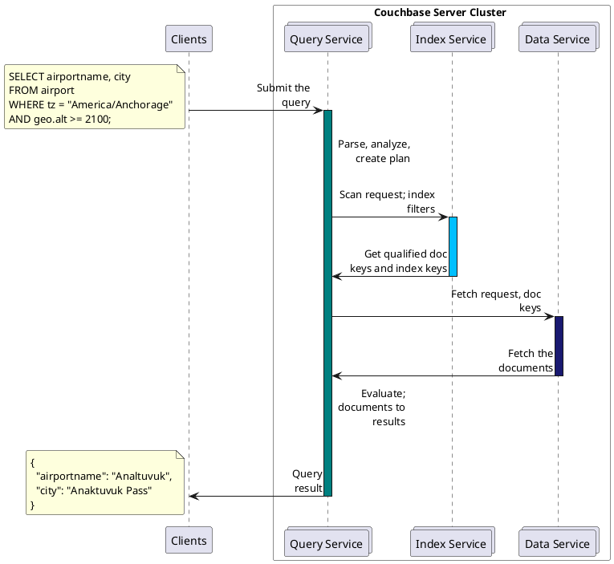
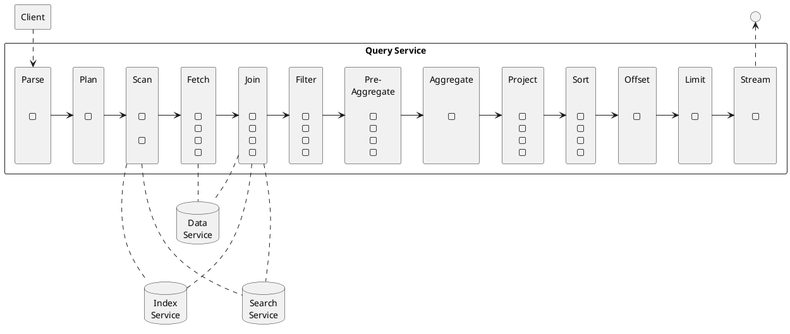
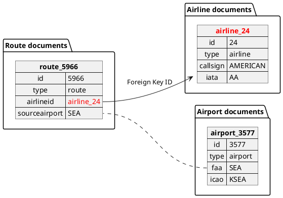

# SELECT Overview

<style type="text/css">

/* details like other paragraph divs */
  .doc details {
    margin-top: 1rem;
  }
  .doc .paragraph + .details {
    margin-top: 1.5rem;
  }

/* summary like other titles */
  .doc details > summary.title {
    font-size: 1rem;
    font-weight: 600;
    line-height: 1.2;
    margin-bottom: 1rem;
    color: #52566c;
  }

</style>

With the SELECT statement, you can query and manipulate JSON data. \

The SELECT statement takes a set of JSON documents from keyspaces as its input, manipulates it and returns a set of JSON documents in the result array.
Since the schema for JSON documents is flexible, JSON documents in the result set have flexible schema as well.

A simple query in {sqlpp} consists of three parts:

* SELECT: specifies the projection, which is the part of the document that is to be returned.
* FROM: specifies the keyspaces to work with.
* WHERE: specifies the query criteria (filters or predicates) that the results must satisfy.

**Examples on this Page**

To use the examples on this page, you must set the query context to the `inventory` scope in the travel sample dataset.
For more information, see [Query Context](n1ql:n1ql-intro/queriesandresults.adoc#query-context).

## Prerequisites

The user executing the SELECT statement must have the [Query Select](learn:security/roles.adoc#query-select) privileges granted on all keyspaces referred in the query.
Note that the SELECT statement may refer to one keyspace, multiple keyspaces, or no keyspaces at all.
For more details about user roles, see
[Authorization](learn:security/authorization-overview.adoc).

<details>
<summary>RBAC Examples</summary>

======
To execute the following statement, the user does not need any special privileges.

```sqlpp
SELECT 1
```

To execute the following statement, the user must have the [Query Select](learn:security/roles.adoc#query-select) privilege on `airline`.

```sqlpp
SELECT * FROM airline;
```

To execute the following statement, the user must have the [Query Select](learn:security/roles.adoc#query-select) privilege on `route` and `airline`.

```sqlpp
SELECT * FROM route
JOIN airline
ON KEYS route.airlineid
WHERE route.airlineid IN ["airline_330", "airline_225"]
```

To execute the following statement, the user must have the [Query Select](learn:security/roles.adoc#query-select) privilege on `airport` and `landmark`.

```sqlpp
SELECT * FROM airport
WHERE city IN (SELECT RAW city FROM landmark);
```

To execute the following statement, the user must have the [Query Select](learn:security/roles.adoc#query-select) privilege on `hotel` and `landmark`.

```sqlpp
SELECT * FROM hotel WHERE city = "Gillingham"
UNION
SELECT * FROM landmark WHERE city = "Gillingham";
```
======
</details>

## Projection and Data Source

To query on a keyspace, you must either specify the document keys or use an index on the keyspace.

The following example uses an index to query the keyspace for airports that are in the America/Anchorage timezone and at an altitude of 2100ft or higher, and returns an array with the airport name and city name for each airport that satisfies the conditions.

**Query**

```sqlpp
SELECT t.airportname, t.city
FROM   airport t
WHERE  tz = "America/Anchorage"
       AND geo.alt >= 2100;
```

**Results**

```JSON
[
  {
        "airportname": "Anaktuvuk Pass Airport",
        "city": "Anaktuvuk Pass",
  }
]
```

The next example queries the keyspace using the document key `"airport_3469"`.

**Query**

```sqlpp
SELECT * FROM airport USE KEYS "airport_3469";
```

**Results**

```JSON
[
  {
    "airport": {
      "airportname": "San Francisco Intl",
      "city": "San Francisco",
      "country": "United States",
      "faa": "SFO",
      "geo": {
        "alt": 13,
        "lat": 37.618972,
        "lon": -122.374889
      },
      "icao": "KSFO",
      "id": 3469,
      "type": "airport",
      "tz": "America/Los_Angeles"
    }
  }
]
```

With projections, you retrieve just the fields that you need and not the entire document.
This is especially useful when querying for a large dataset as it results in shorter processing times and better performance.

Beginning with Couchbase Server 7.6, the projection is returned in the order specified by the query.
In prior versions, the projection was sorted alphabetically.
To revert to this behavior, use the [sort_projection](n1ql:n1ql-manage/query-settings.adoc#sort_projection) request-level parameter.

The SELECT statement provides a variety of data processing capabilities such as [filtering](#filtering), [querying across relationships](#querying-across-relationships) using JOINs or subqueries, [deep traversal of nested documents](#deep-traversal-for-nested-documents), [aggregation](#aggregation), [combining result sets](#combining-resultsets-using-operators) using operators, [grouping](#grouping-sorting-and-limiting-results), [sorting](#grouping-sorting-and-limiting-results), and more.
Follow the links for examples that demonstrate each capability.

## SELECT Statement Processing

The SELECT statement queries a keyspace and returns a JSON array that contains zero or more objects.

The following diagram shows the query execution workflow at a high level and illustrates the interaction with the query, index, and data services.

**Query Execution Workflow**



The SELECT statement is executed as a sequence of steps.
Each step in the process produces result objects that are then used as inputs in the next step until all steps in the process are complete.
While the workflow diagram shows all the possible phases a query goes through before returning a result, the clauses and predicates in a query decide the phases and the number of times that the query goes through.
For example, sort phase can be skipped when there is no ORDER BY clause in the query; scan-fetch-join phase will execute multiple times for correlated subqueries.

The following diagram shows the possible elements and operations during query execution.

<a name="query-execution-phases"></a>**Query Execution Phases**



Some phases execute serially, while others execute in parallel, as determined by their parent operator.

The following table summarizes all the Query Phases used in an Execution Plan:

| Query Phase | Description |
| --- | --- |
| Parse | Analyzes the query and available access path options for each keyspace in the query to create a query plan and execution infrastructure. |
| Plan | Selects the access path, determines the join order and join types, and then creates the infrastructure needed to execute the plan. |
| Scan | Scans the data from the Index Service. |
| Fetch | Fetches the data from the Data Service. |
| Join | Joins the data from the Data Service. |
| Filter | Filters the result objects by specifying conditions in the WHERE clause. |
| Pre-Aggregate | Internal set of tools to prepare the Aggregate phase. |
| Aggregate | Performs aggregating functions and window functions. |
| Project | Retrieves only the fields required for the client. |
| Sort | Orders and sorts items in the result set in the order specified by the ORDER BY clause. |
| Offset | Skips the first _n_ items in the result object as specified by the OFFSET clause. |
| Limit | Limits the number of results returned using the LIMIT clause. |
| Stream | Streams the final results back to the client. |

The possible elements and operations in a query include:

* Specifying the keyspace that is queried.
* Specifying the document keys or using indexes to access the documents.
* Fetching the data from the data service.
* Filtering the result objects by specifying conditions in the WHERE clause.
* Removing duplicate result objects from the resultset by using the DISTINCT clause.
* Grouping and aggregating the result objects.
* Ordering (sorting) items in the resultset in the order specified by the ORDER BY expression list.
* Skipping the first `n` items in the result object as specified by the OFFSET clause.
* Limiting the number of results returned using the LIMIT clause.

## Data Processing Capabilities

### Filtering
You can filter the query results using the WHERE clause.
Consider the following example which queries for all airports in the America/Anchorage timezone that are at an altitude of 2000ft or more.
The WHERE clause specifies the conditions that must be satisfied by the documents to be included in the resultset, and the resultset is returned as an array of airports that satisfy the condition.

**📌 NOTE**\
The keys in the result object are ordered alphabetically at each level.

**Query**

```sqlpp
SELECT *
FROM   airport
WHERE  tz = "America/Anchorage"
       AND geo.alt >= 2000;
```

**Result**

```JSON
[
  {
    "airport": {
      "airportname": "Arctic Village Airport",
      "city": "Arctic Village",
      "country": "United States",
      "faa": "ARC",
      "geo": {
        "alt": 2092,
        "lat": 68.1147,
        "lon": -145.579
      },
      "icao": "PARC",
      "id": 6729,
      "type": "airport",
      "tz": "America/Anchorage"
    }
  },
  {
    "airport": {
      "airportname": "Anaktuvuk Pass Airport",
      "city": "Anaktuvuk Pass",
      "country": "United States",
      "faa": "AKP",
      "geo": {
        "alt": 2103,
        "lat": 68.1336,
        "lon": -151.743
      },
      "icao": "PAKP",
      "id": 6712,
      "type": "airport",
      "tz": "America/Anchorage"
    }
  }
]
```

### Querying Across Relationships
You can use the SELECT statement to query across relationships using the JOIN clause or subqueries.

#### JOIN Clause
Before delving into examples, take a look at a simplified representation of the data model of the `inventory` scope in the `travel-sample` bucket, which is used in the following examples.
For more details about the data model, see [Travel App Data Model](java-sdk:ref:travel-app-data-model.adoc).

**Data model of inventory scope, simplified**



The [first example](#example_1) uses a JOIN clause to find the distinct airline details which have routes that start from SFO.
This example JOINS the document from the `route` keyspace with documents from the `airline` keyspace using the KEY "airlineid".

* Documents from the `route` keyspace are on the left side of the JOIN, and documents from the `airline` keyspace are on the right side of the JOIN.
* The documents from the `route` keyspace (on the left) contain the foreign key "airlineid" of documents from the `airline` keyspace (on the right).

**Query**

```sqlpp
SELECT DISTINCT airline.name, airline.callsign,
  route.destinationairport, route.stops, route.airline
FROM route
  JOIN airline
  ON KEYS route.airlineid
WHERE route.sourceairport = "SFO"
LIMIT 2;
```

**Results**

```JSON
[
  {
    "airline": "B6",
    "callsign": "JETBLUE",
    "destinationairport": "AUS",
    "name": "JetBlue Airways",
    "stops": 0
  },
  {
    "airline": "B6",
    "callsign": "JETBLUE",
    "destinationairport": "BOS",
    "name": "JetBlue Airways",
    "stops": 0
  }
]
```

Let’s consider [another example](#example_2) which finds the number of distinct airports where AA has routes.
In this example:

* Documents from the `airline` keyspace are on the left side of the JOIN, and documents from the `route` keyspace are on the right side.
* The WHERE clause predicate `airline.iata = "AA"` is on the left side keyspace `airline`.

This example illustrates a special kind of JOIN where the documents on the right side of JOIN contain the foreign key reference to the documents on the left side.
Such JOINs are referred to as index JOIN.
For details, see [Index JOIN Clause](n1ql-language-reference/from.adoc#index-join-clause).

Index JOIN requires a special inverse index `route_airlineid` on the JOIN key `route.airlineid`.
Create this index using the following command:

```sqlpp
CREATE INDEX route_airlineid ON route(airlineid);
```

Now we can execute the following query.

**Query**

```sqlpp
SELECT Count(DISTINCT route.sourceairport) AS distinctairports1
FROM airline
  JOIN route
  ON KEY route.airlineid FOR airline
WHERE airline.iata = "AA";
```

**Results**

```JSON
[
   {
      "distinctairports1": 429
   }
]
```

#### Subqueries
A subquery is an expression that is evaluated by executing an inner SELECT query.
Subqueries can be used in most places where you can use an expression such as projections, FROM clauses, and WHERE clauses.

A subquery is executed once for every input document to the outer statement and it returns an array every time it is evaluated.
See [Subqueries](n1ql-language-reference/subqueries.adoc) for more details.

**Query**

```sqlpp
SELECT *
FROM   (SELECT t.airportname
        FROM   (SELECT *
                FROM   airport t
                WHERE  country = "United States"
                LIMIT  1) AS s1) AS s2;
```

**Results**

```JSON
[
  {
    "s2": {
      "airportname": "Barter Island Lrrs"
    }
  }
]
```

### Deep Traversal for Nested Documents
When querying a keyspace with nested documents, SELECT provides an easy way to traverse deep nested documents using the dot notation and NEST and UNNEST clauses.

#### Dot Notation
The following query looks for the schedule, and accesses the flight id for the destination airport "ALG".
Since a given flight has multiple schedules, the attribute `schedule` is an array containing all schedules for the specified flight.
You can access the individual array elements using the array indexes.
For brevity, we’re limiting the number of results in the query to 1.

**Query**

```sqlpp
SELECT t.schedule[0].flight AS flightid
FROM route t
WHERE destinationairport="ALG"
LIMIT 1;
```

**Results**

```JSON
[
  {
    "flightid": "AH631"
  }
]
```

#### NEST and UNNEST
Note that an array is created with the matching nested documents.
In this example:

* The `airline` field in the result is an array of the `airline` documents that are matched with the key `route.airlineid`.
* Hence, the projection is accessed as `airline[0]` to pick the first element of the array.

**Query**

```sqlpp
SELECT DISTINCT route.sourceairport,
                route.airlineid,
                airline[0].callsign
FROM route
NEST airline
  ON KEYS route.airlineid
WHERE route.airline = "AA"
LIMIT 4;
```

**Results**

```JSON
[
  {
    "airlineid": "airline_24",
    "callsign": "AMERICAN",
    "sourceairport": "ABE"
  },
  {
    "airlineid": "airline_24",
    "callsign": "AMERICAN",
    "sourceairport": "ABI"
  },
  {
    "airlineid": "airline_24",
    "callsign": "AMERICAN",
    "sourceairport": "ABQ"
  },
  {
    "airlineid": "airline_24",
    "callsign": "AMERICAN",
    "sourceairport": "ABZ"
  }
]
```

The following example uses the UNNEST clause to retrieve the author names from the `reviews` object.

**Query**

```sqlpp
SELECT r.author
FROM hotel t
UNNEST t.reviews r
LIMIT 4;
```

**Results**

```JSON
[
  {
    "author": "Ozella Sipes"
  },
  {
    "author": "Barton Marks"
  },
  {
    "author": "Blaise O'Connell IV"
  },
  {
    "author": "Nedra Cronin"
  }
]
```

### Aggregation
As part of a single SELECT statement, you can also perform aggregation using the SUM, COUNT, AVG, MIN, MAX, or ARRAY_AVG functions.

The following example counts the total number of flights to SFO:

**Query**

```sqlpp
SELECT count(schedule[*]) AS totalflights
FROM route t
WHERE destinationairport="SFO";
```

**Results**

```JSON
[
  {
    "totalflights": 250
  }
]
```

### Combining Resultsets Using Operators
You can combine the result sets using the UNION or INTERSECT operators.

Consider the following example which looks for the first schedule for flights to "SFO" and "BOS":

**Query**

```sqlpp
(SELECT t.schedule[0]
 FROM route t
 WHERE destinationairport = "SFO"
 LIMIT 1)
UNION ALL
(SELECT t.schedule[0]
 FROM route t
 WHERE destinationairport = "BOS"
 LIMIT 1);
```

**Results**

```JSON
[
  {
    "$1": {
      "day": 0,
      "flight": "AI339",
      "utc": "23:05:00"
    }
  },
  {
    "$1": {
      "day": 0,
      "flight": "AM982",
      "utc": "09:11:00"
    }
  }
]
```

### Grouping, Sorting, and Limiting Results
You can perform further processing on the data in your result set before the final projection is generated.
You can group data using the GROUP BY clause, sort data using the ORDER BY clause, and you can limit the number of results included in the result set using the LIMIT clause.

The following example looks for the number of airports at an altitude of 5000ft or higher and groups the results by country and timezone.
It then sorts the results by country names and timezones (ascending order by default).

**Query**

```sqlpp
SELECT COUNT(*) AS count,
       t.country AS country,
       t.tz AS timezone
FROM airport t
WHERE geo.alt >= 5000
GROUP BY t.country, t.tz
ORDER BY t.country, t.tz;
```

**Results**

```JSON
[
  {
    "count": 2,
    "country": "France",
    "timezone": "Europe/Paris"
  },
  {
    "count": 57,
    "country": "United States",
    "timezone": "America/Denver"
  },
  {
    "count": 7,
    "country": "United States",
    "timezone": "America/Los_Angeles"
  },
  {
    "count": 4,
    "country": "United States",
    "timezone": "America/Phoenix"
  },
  {
    "count": 1,
    "country": "United States",
    "timezone": "Pacific/Honolulu"
  }
]
```

### Index Selection

The optimizer attempts to select an appropriate secondary index for a query based on the filters in the WHERE clause.
If it cannot select a secondary query, the query service falls back on the primary index for the keyspace.

By default, secondary indexes don’t index a document if the leading index key is MISSING in the document.
This means that when a query selects a field which is MISSING in some documents, the optimizer will not be able to choose a secondary index which uses that field as a leading key.
There are two ways to resolve this:

* In the query, use a WHERE clause to filter out any documents where the required field is MISSING.
The minimum filter you can use to do this is `IS NOT MISSING`.
This is usually only necessary in queries which do not otherwise have a WHERE clause; for example, some GROUP BY and aggregate queries.
* In the index definition, use the `INCLUDE MISSING` modifier in the leading index key, to index documents where the specified key is missing.
For more information, see [INCLUDE MISSING Clause](n1ql:n1ql-language-reference/createindex.adoc#include-missing).

(((sargable)))
A query is said to be _sargable_ if the optimizer is able to select an index to speed up the execution of the query.

<a name="ex-missing"></a>**Field with MISSING values -- cannot choose the secondary index**

This example uses an index `idx_airport_missing` that is defined by following statement.

**Index**

```sqlpp
CREATE INDEX idx_airport_missing
ON airport(district, name);
```

**Query**

```sqlpp
EXPLAIN SELECT district FROM airport;
```

The query selects the `district` field, which is MISSING for many documents in the `airport` keyspace.

**Result**

```json
[
  {
    "cardinality": 1968,
    "cost": 2234.798843874139,
    "plan": {
      "#operator": "Sequence",
      "~children": [
        {
          "#operator": "PrimaryScan3",
          "bucket": "travel-sample",
          "index": "def_inventory_airport_primary", // ①
          "index_projection": {
            "primary_key": true
          },
// ...
        }
      ]
    },
    "text": "SELECT district FROM airport;"
  }
]
```

1. Therefore the optimizer falls back on the `def_inventory_airport_primary` index.

<a name="ex-filter"></a>**Filter out MISSING values -- correct secondary index is chosen**

```sqlpp
EXPLAIN SELECT district FROM airport
WHERE district IS NOT MISSING;
```

The WHERE clause filters out documents where `district` is not MISSING.

```json
[
  {
    "cardinality": 1.0842021724855044e-19,
    "cost": 1.0974078994531663e-16,
    "plan": {
      "#operator": "Sequence",
      "~children": [
        {
          "#operator": "IndexScan3",
          "bucket": "travel-sample",
          "covers": [
            "cover ((`airport`.`district`))",
            "cover ((`airport`.`name`))",
            "cover ((meta(`airport`).`id`))"
          ],
          "index": "idx_airport_missing", // ①
// ...
        }
      ]
    },
    "text": "SELECT district FROM airport\nWHERE district IS NOT MISSING;"
  }
]
```

1. The optimizer correctly chooses the `idx_airport_missing` index.

<a name="ex-include"></a>**Index includes MISSING values -- correct secondary index is chosen**

This example uses an index `idx_airport_include` that is defined by following statement.

**Index**

```sqlpp
CREATE INDEX idx_airport_include
ON airport(district INCLUDE MISSING, name);
```

**Query**

```sqlpp
EXPLAIN SELECT district FROM airport;
```

As in [Field with MISSING values -- cannot choose the secondary index](#ex-missing), the query selects the `district` field, which is MISSING for many documents in the `airport` keyspace.

**Result**

```json
[
  {
    "cardinality": 1968,
    "cost": 761.4521745648723,
    "plan": {
      "#operator": "Sequence",
      "~children": [
        {
          "#operator": "IndexScan3",
          "bucket": "travel-sample",
          "covers": [
            "cover ((`airport`.`district`))",
            "cover ((`airport`.`name`))",
            "cover ((meta(`airport`).`id`))"
          ],
          "index": "idx_airport_include", // ①
// ...
        }
      ]
    },
    "text": "SELECT district FROM airport;"
  }
]
```

1. In this case, since the lead key in the index includes MISSING values, the optimizer correctly chooses the `idx_airport_include` index.

For further examples, refer to [indexes:groupby-aggregate-performance.adoc](indexes:groupby-aggregate-performance.adoc).
